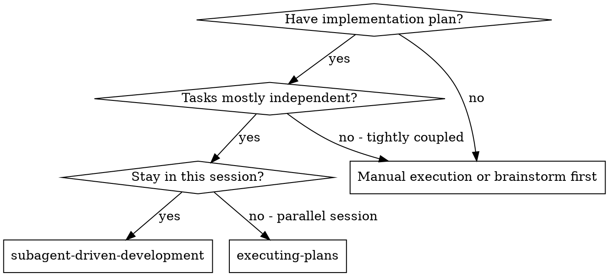
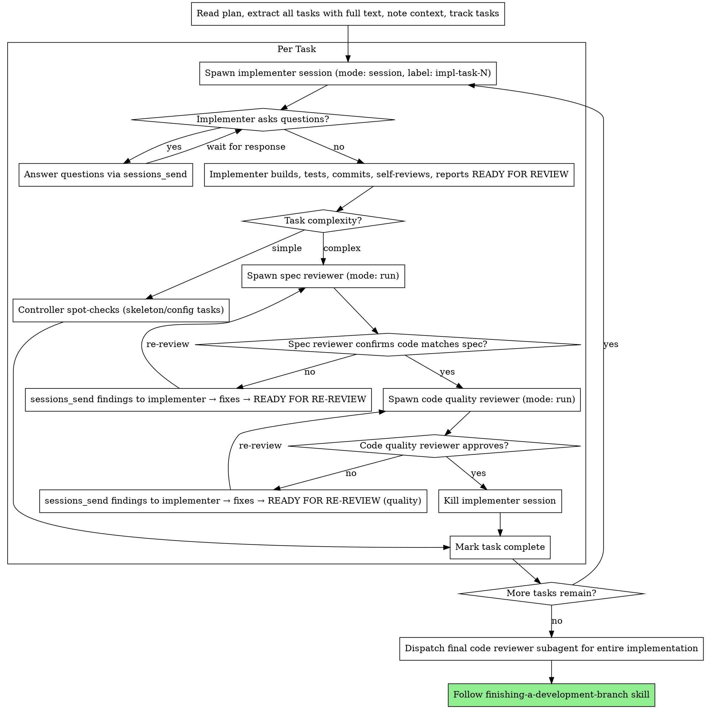

# Subagent-Driven Development

Execute plan by dispatching persistent implementer sessions per task, with two-stage review after each: spec compliance first, then code quality. Implementers stay alive for review feedback — no cold-start fix agents.

**Core principle:** Persistent implementer + one-shot reviewers + warm-context fix loop = high quality, fast iteration

## When to Use



**vs. Executing Plans (parallel session):**
- Same session (no context switch)
- Persistent implementer per task (warm context for fixes)
- Two-stage review after each task: spec compliance first, then code quality
- Faster iteration (no human-in-loop between tasks)

## The Process



## Orchestration Flow (Controller)

```
1. Controller creates bead for task (if not already created from plan)
2. Spawn implementer (mode: "session", label: "impl-task-N")
   — pass bead ID in prompt so implementer can claim + close it
3. Implementer claims bead, builds, self-reviews, reports "READY FOR REVIEW"
4. Assess task complexity:
   - Simple (skeleton, config, boilerplate) → controller spot-checks, skip to step 8
   - Complex (logic, integrations, algorithms) → continue to step 5
5. Spawn spec reviewer (mode: "run") — reads actual code, returns findings
6. If issues → sessions_send(label: "impl-task-N", message: findings)
   → implementer fixes (warm context), reports "READY FOR RE-REVIEW"
   → re-spawn spec reviewer → repeat until ✅
7. Spawn code quality reviewer (mode: "run") → same loop if issues
8. Both pass (or spot-check sufficient) → tell implementer "APPROVED"
   → implementer closes its bead, controller kills the session
9. Move to next task
```

## Bead Ownership & Orchestration State

**Beads ARE the orchestration state.** No separate checkpoint files needed.

**Rule: whoever claims the bead closes it.**

- Controller creates beads from the plan (has full plan context)
- Controller passes bead ID to implementer in the task prompt
- Implementer claims the bead (`bd claim`) at start of work
- Implementer closes the bead (`bd close`) after receiving "APPROVED"
- This ensures bead state survives controller session boundaries

**Session recovery:** If the controller session dies/compacts mid-epic, any new session can pick up where things left off:
```bash
bd list                           # see what's done, in-progress, and open
bd list --status=open             # find next tasks to dispatch
bd children <epic_id>             # see full task breakdown
```
The beads backlog tells you everything: what's closed (done), what's claimed (in-progress), what's open with resolved deps (ready to dispatch). No orchestration memory needed beyond `bd list`.

**Why persistent sessions matter:** The implementer keeps its warm context — it knows the codebase, the task, the decisions it made. When review findings come in, it makes targeted fixes without re-reading everything or guessing at what a previous agent built.

## Task Complexity Heuristics

Not every task needs the full two-stage review ceremony. The controller should assess:

**Simple tasks (spot-check sufficient):**
- Project scaffolding / skeleton setup
- Config file creation
- Boilerplate / file structure
- Dependency additions
- Simple renames or moves

**Complex tasks (full review required):**
- Business logic implementation
- Algorithm or data structure work
- Integration with external systems
- State management / concurrency
- Security-sensitive code
- Anything with more than trivial test coverage

The controller is empowered to make this judgment call. When in doubt, run the full review.

## Prompt Templates

- `./implementer-prompt.md` - Dispatch implementer subagent (persistent session)
- `./spec-reviewer-prompt.md` - Dispatch spec compliance reviewer subagent (one-shot)
- `./code-quality-reviewer-prompt.md` - Dispatch code quality reviewer subagent (one-shot)

## Example Workflow

```
You: I'm using Subagent-Driven Development to execute this plan.

[Read plan file once: docs/plans/feature-plan.md]
[Extract all 5 tasks with full text and context]
[Track all tasks (beads if available, otherwise inline)]

Task 1: Project skeleton (SIMPLE — spot-check only)

[Spawn implementer: sessions_spawn(mode: "session", label: "impl-task-1")]
Implementer: [No questions, proceeds]
Implementer:
  - Created project structure
  - Added base config files
  - Self-review: All good
  - READY FOR REVIEW

[Controller spot-checks — skeleton looks correct]
[sessions_send(label: "impl-task-1", message: "APPROVED")]
Implementer: Closed bead. Done.
[Kill implementer session]

Task 2: Recovery modes (COMPLEX — full review)

[Spawn implementer: sessions_spawn(mode: "session", label: "impl-task-2")]
Implementer: [No questions, proceeds]
Implementer:
  - Added verify/repair modes
  - 8/8 tests passing
  - Self-review: All good
  - READY FOR REVIEW

[Spawn spec reviewer (mode: "run")]
Spec reviewer: ❌ Issues:
  - Missing: Progress reporting (spec says "report every 100 items")
  - Extra: Added --json flag (not requested)

[sessions_send(label: "impl-task-2", message: spec findings)]
Implementer: [Has full context — knows exactly what to fix]
  - Removed --json flag
  - Added progress reporting
  - READY FOR RE-REVIEW

[Spawn spec reviewer again (mode: "run")]
Spec reviewer: ✅ Spec compliant now

[Spawn code quality reviewer (mode: "run")]
Code reviewer: Issues (Important): Magic number (100)

[sessions_send(label: "impl-task-2", message: quality findings)]
Implementer: Extracted PROGRESS_INTERVAL constant
  - READY FOR RE-REVIEW

[Spawn code quality reviewer again (mode: "run")]
Code reviewer: ✅ Approved

[sessions_send(label: "impl-task-2", message: "APPROVED")]
Implementer: Closed bead. Done.

[Kill implementer session]

...

[After all tasks]
[Dispatch final code-reviewer]
Final reviewer: All requirements met, ready to merge

Done!
```

## Advantages

**vs. Manual execution:**
- Subagents follow TDD naturally
- Fresh context per task (no confusion)
- Parallel-safe (subagents don't interfere)
- Subagent can ask questions (before AND during work)

**vs. Executing Plans:**
- Same session (no handoff)
- Continuous progress (no waiting)
- Review checkpoints automatic

**Persistent sessions (vs. one-shot implementers):**
- Implementer keeps warm context for review fixes
- No cold-start re-reading of codebase on fix iterations
- Targeted fixes instead of guessing at previous agent's intent
- Fewer tokens burned on context re-establishment
- Natural back-and-forth between controller and implementer

**Efficiency gains:**
- No file reading overhead (controller provides full text)
- Controller curates exactly what context is needed
- Subagent gets complete information upfront
- Questions surfaced before work begins (not after)
- Simple tasks skip expensive review ceremony

**Quality gates:**
- Self-review catches issues before handoff
- Two-stage review: spec compliance, then code quality
- Review loops with warm-context fixes (not cold restarts)
- Spec compliance prevents over/under-building
- Code quality ensures implementation is well-built
- Controller complexity assessment avoids ceremony on trivial tasks

**Cost:**
- More subagent invocations (implementer + up to 2 reviewers per complex task)
- Controller does more prep work (extracting all tasks upfront)
- Review loops add iterations (but with warm context, fewer iterations needed)
- Simple tasks skip reviewers entirely (cost savings)
- Catches issues early (cheaper than debugging later)

## Refactor Tracking (RCA Traceability)

When an implementer subagent identifies code needing refactoring:

1. **Implementer reports it** — subagent surfaces "this needs refactoring" in its output
2. **Controller creates the bead:**
   ```bash
   bd create -t "Refactor: <what and why>" --type=task -p 3 --parent=<parent_bead_id>
   bd update <refactor_id> --add-label refactor
   bd update <refactor_id> --notes="Discovered during <parent_bead_id>, Task N. Reason: <why>"
   ```
3. **Don't dispatch a refactor subagent mid-flow.** Log it and continue.
4. **After all tasks complete**, surface pending refactor beads to architect before finishing:
   ```bash
   bd children <parent_bead_id>
   bd list --label=refactor --status=open
   ```

## Red Flags

**Never:**
- Start implementation on main/master branch without explicit user consent
- Proceed with unfixed issues on complex tasks
- Dispatch multiple implementation subagents in parallel (conflicts)
- Make subagent read plan file (provide full text instead)
- Skip scene-setting context (subagent needs to understand where task fits)
- Ignore subagent questions (answer before letting them proceed)
- Accept "close enough" on spec compliance (spec reviewer found issues = not done)
- Skip review loops (reviewer found issues = implementer fixes = review again)
- Let implementer self-review replace actual review on complex tasks (both are needed)
- **Start code quality review before spec compliance is ✅** (wrong order)
- Move to next task while either review has open issues
- **Forget to kill implementer sessions after reviews pass** (clean up after yourself)
- **Close beads from the controller** (implementer owns the bead lifecycle — it claims, it closes)
- **Skip passing the bead ID to the implementer** (no bead ID = orphaned bead on session death)

**If subagent asks questions:**
- Answer clearly and completely
- Provide additional context if needed
- Don't rush them into implementation

**If reviewer finds issues:**
- Route findings to the still-alive implementer via `sessions_send`
- Implementer fixes with full context (no cold start)
- Re-spawn reviewer to verify fixes
- Repeat until approved
- Don't skip the re-review

**If subagent fails task:**
- Send fix instructions to the persistent session first
- Only dispatch a new subagent if the session is unrecoverable
- Don't try to fix manually (context pollution)

## Integration

**Required workflow skills:**
- **using-git-worktrees** - REQUIRED: Set up isolated workspace before starting
- **writing-plans** - Creates the plan this skill executes
- **requesting-code-review** - Code review template for reviewer subagents
- **finishing-a-development-branch** - Complete development after all tasks

**Subagents should use:**
- **test-driven-development** - Subagents follow TDD for each task

**Alternative workflow:**
- **executing-plans** - Use for parallel session instead of same-session execution
