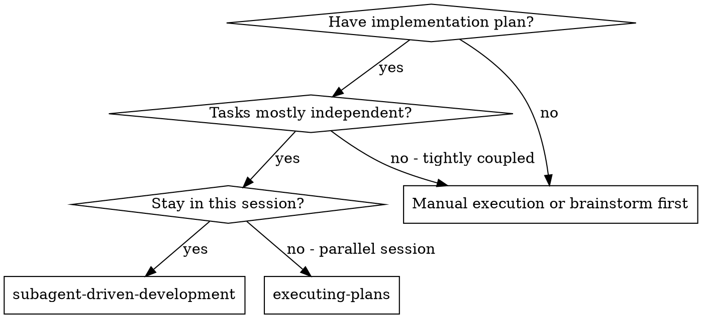
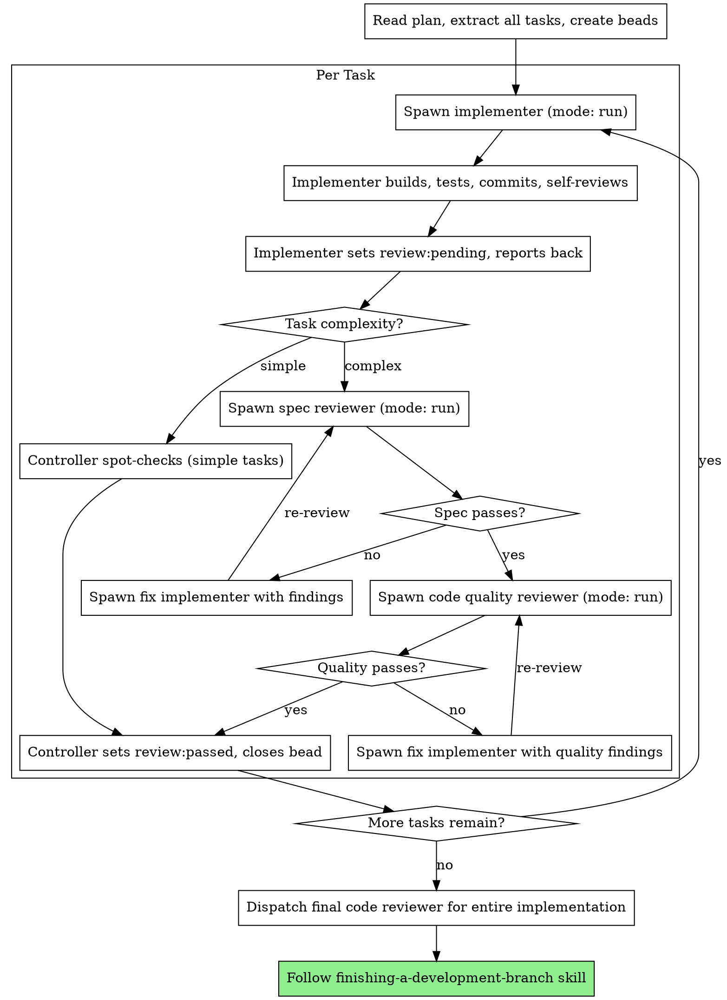

# Subagent-Driven Development

Execute plan by dispatching one-shot implementer subagents per task, with external review gates before bead closure. Implementers build and self-review; external reviewers verify independently. Beads track the full lifecycle.

**Core principle:** One-shot implementers + external review gates + bead state dimensions = reliable, channel-agnostic orchestration

## When to Use



**vs. Executing Plans (parallel session):**
- Same session (no context switch)
- External review gates per task (not just self-review)
- Bead state dimensions track lifecycle across session boundaries
- Faster iteration (no human-in-loop between tasks)

## The Process



## Orchestration Flow (Controller)

```
1. Controller creates bead for task (if not already created from plan)
2. Spawn implementer (mode: "run")
   — pass bead ID in prompt so implementer can claim it and set review state
3. Implementer claims bead, builds, self-reviews, commits
4. Implementer sets `bd set-state <id> review=pending` and reports back
   — implementer does NOT close the bead
5. Assess task complexity:
   - Simple (skeleton, config, boilerplate) → controller spot-checks, skip to step 9
   - Complex (logic, integrations, algorithms) → continue to step 6
6. Controller verifies the commit SHA from the report exists: `git log --oneline | head -5`
7. Spawn spec reviewer (mode: "run") — reads actual code, returns findings
8. If issues:
   - Controller sets `bd set-state <id> review=failed --reason "spec issues"`
   - Spawn NEW fix implementer (mode: "run") with findings baked into prompt
   - Fix implementer picks up the same bead (still in_progress), fixes, commits
   - Fix implementer sets review=pending again → re-spawn spec reviewer → repeat
9. Spec passes → spawn code quality reviewer (mode: "run") → same loop if issues
10. Both pass (or spot-check sufficient):
    - Controller sets `bd set-state <id> review=passed`
    - Controller closes the bead: `bd close <id>`
11. Move to next task
```

## Bead Ownership & Review State

**Beads ARE the orchestration state.** No separate checkpoint files needed.

### State Dimensions

Beads use the `review` state dimension to track the review lifecycle:

| State | Meaning | Set by |
|-------|---------|--------|
| `review:pending` | Implementer finished, awaiting external review | Implementer |
| `review:passed` | External review approved | Controller |
| `review:failed` | External review found issues | Controller |

### Ownership Rules

| Action | Owner | Why |
|--------|-------|-----|
| Create bead | Controller | Has full plan context |
| Claim bead (`in_progress`) | Implementer | Signals "I'm working on this" |
| Set `review:pending` | Implementer | Signals "my work is done, review me" |
| Set `review:passed` | Controller | Only after external review approves |
| Set `review:failed` | Controller | When external review finds issues |
| Close bead | Controller | Only after `review:passed` |

**Why the controller closes the bead (not the implementer):**
The implementer can't be both author and final approver. External review is a gate — the bead stays `in_progress` until an independent reviewer confirms the work. This prevents "done before verified" states.

### Session Recovery

If the controller session dies/compacts mid-epic, any new session picks up:

```bash
bd list                               # what's done, in-progress, open
bd list --status=in_progress          # what's being worked on
bd state <id> review                  # where in the review cycle
bd list --status=open                 # find next tasks to dispatch
bd children <epic_id>                 # see full task breakdown
```

The beads backlog + review state dimension tells you everything:
- `closed` → done and verified
- `in_progress` + `review:pending` → needs external review
- `in_progress` + `review:failed` → needs fix implementer
- `in_progress` + no review state → implementer still working (or died mid-work)
- `open` with resolved deps → ready to dispatch

## Task Complexity Heuristics

Not every task needs the full two-stage review ceremony. The controller should assess:

**Simple tasks (spot-check sufficient):**
- Project scaffolding / skeleton setup
- Config file creation
- Boilerplate / file structure
- Dependency additions
- Simple renames or moves

**Complex tasks (full review required):**
- Business logic implementation
- Algorithm or data structure work
- Integration with external systems
- State management / concurrency
- Security-sensitive code
- Anything with more than trivial test coverage

The controller is empowered to make this judgment call. When in doubt, run the full review.

## Prompt Templates

- `./implementer-prompt.md` - Dispatch implementer subagent (one-shot, sets review:pending)
- `./fix-implementer-prompt.md` - Dispatch fix implementer with review findings (one-shot)
- `./spec-reviewer-prompt.md` - Dispatch spec compliance reviewer subagent (one-shot)
- `./code-quality-reviewer-prompt.md` - Dispatch code quality reviewer subagent (one-shot)

## Example Workflow

```
You: I'm using Subagent-Driven Development to execute this plan.

[Read plan file once: docs/plans/feature-plan.md]
[Extract all 5 tasks with full text and context]
[Create beads for all tasks]

Task 1: Project skeleton (SIMPLE — spot-check only)

[Spawn implementer: sessions_spawn(mode: "run")]
Implementer:
  - Claimed bead
  - Created project structure
  - Added base config files
  - Self-review: All good
  - Set review:pending
  - READY FOR REVIEW

[Controller spot-checks — skeleton looks correct]
[bd set-state <id> review=passed]
[bd close <id>]

Task 2: Recovery modes (COMPLEX — full review)

[Spawn implementer: sessions_spawn(mode: "run")]
Implementer:
  - Claimed bead
  - Added verify/repair modes
  - 8/8 tests passing
  - Self-review: All good
  - Set review:pending
  - Commit: abc1234
  - READY FOR REVIEW

[Verify commit: git log --oneline | head -3 → abc1234 confirmed]
[Spawn spec reviewer (mode: "run")]
Spec reviewer: ❌ Issues:
  - Missing: Progress reporting (spec says "report every 100 items")
  - Extra: Added --json flag (not requested)

[bd set-state <id> review=failed --reason "spec: missing progress reporting, extra --json flag"]
[Spawn fix implementer with findings baked into prompt]
Fix implementer:
  - Removed --json flag
  - Added progress reporting
  - Set review:pending
  - Commit: def5678
  - READY FOR RE-REVIEW

[Spawn spec reviewer again (mode: "run")]
Spec reviewer: ✅ Spec compliant

[Spawn code quality reviewer (mode: "run")]
Code reviewer: Issues (Important): Magic number (100)

[bd set-state <id> review=failed --reason "quality: magic number"]
[Spawn fix implementer with quality findings]
Fix implementer:
  - Extracted PROGRESS_INTERVAL constant
  - Set review:pending
  - Commit: ghi9012
  - READY FOR RE-REVIEW

[Spawn code quality reviewer again (mode: "run")]
Code reviewer: ✅ Approved

[bd set-state <id> review=passed]
[bd close <id>]

...

[After all tasks]
[Dispatch final code-reviewer]
Final reviewer: All requirements met, ready to merge

Done!
```

## Advantages

**vs. Manual execution:**
- Subagents follow TDD naturally
- Fresh context per task (no confusion)
- Parallel-safe (subagents don't interfere)
- External review gates prevent self-approved work

**vs. Executing Plans:**
- Same session (no handoff)
- Continuous progress (no waiting)
- Review checkpoints automatic

**Channel-agnostic (mode: "run"):**
- Works on Slack, Discord, or any channel
- No dependency on thread-bound persistent sessions
- Simpler lifecycle — implementer runs, reports, exits

**Review state dimensions:**
- `review:pending/passed/failed` visible to any session via `bd state`
- Beads never close prematurely (controller owns closure after review)
- Session recovery is trivial — check bead status + review state
- Full audit trail of review cycles

**Efficiency gains:**
- No file reading overhead (controller provides full text)
- Controller curates exactly what context is needed
- Subagent gets complete information upfront
- Simple tasks skip expensive review ceremony

**Quality gates:**
- Self-review catches issues before handoff
- External review gate: spec compliance, then code quality
- Fix implementers get findings baked into prompt (targeted fixes)
- Spec compliance prevents over/under-building
- Code quality ensures implementation is well-built
- Controller complexity assessment avoids ceremony on trivial tasks

**Cost:**
- More subagent invocations on review failures (new fix implementer per cycle)
- Fix implementers need to re-read code (no warm context)
- Mitigated by: controller provides full context + specific findings in prompt
- Simple tasks skip reviewers entirely (cost savings)
- Catches issues early (cheaper than debugging later)

## Refactor Tracking (RCA Traceability)

When an implementer subagent identifies code needing refactoring:

1. **Implementer reports it** — subagent surfaces "this needs refactoring" in its output
2. **Controller creates the bead:**
   ```bash
   bd create -t "Refactor: <what and why>" --type=task -p 3 --parent=<parent_bead_id>
   bd update <refactor_id> --add-label refactor
   bd update <refactor_id> --notes="Discovered during <parent_bead_id>, Task N. Reason: <why>"
   ```
3. **Don't dispatch a refactor subagent mid-flow.** Log it and continue.
4. **After all tasks complete**, surface pending refactor beads to architect before finishing:
   ```bash
   bd children <parent_bead_id>
   bd list --label=refactor --status=open
   ```

## Red Flags

**Never:**
- Start implementation on main/master branch without explicit user consent
- Proceed with unfixed issues on complex tasks
- Dispatch multiple implementation subagents in parallel (conflicts)
- Make subagent read plan file (provide full text instead)
- Skip scene-setting context (subagent needs to understand where task fits)
- Ignore subagent questions (answer before letting them proceed)
- Accept "close enough" on spec compliance (spec reviewer found issues = not done)
- Skip review loops (reviewer found issues = fix implementer = review again)
- Let implementer self-review replace external review on complex tasks
- **Start code quality review before spec compliance is ✅** (wrong order)
- Move to next task while review has open issues
- **Close the bead before external review passes** (controller owns closure)
- **Skip passing the bead ID to the implementer** (no bead ID = orphaned state)
- **Trust the implementer's report without verifying the commit exists**

**If reviewer finds issues:**
- Controller sets `review=failed` on the bead
- Spawn a new fix implementer with findings baked into the prompt
- Fix implementer picks up the same bead, fixes, sets `review=pending`
- Re-spawn reviewer to verify fixes
- Repeat until approved
- Don't skip the re-review

**If implementer fails or dies mid-task:**
- Bead stays `in_progress` with no `review:pending` state
- Controller can check `bd state <id> review` — absence of state means unfinished
- Spawn a new implementer for the same bead

## Integration

**Required workflow skills:**
- **using-git-worktrees** - REQUIRED: Set up isolated workspace before starting
- **writing-plans** - Creates the plan this skill executes
- **requesting-code-review** - Code review template for reviewer subagents
- **finishing-a-development-branch** - Complete development after all tasks

**Subagents should use:**
- **test-driven-development** - Subagents follow TDD for each task

**Alternative workflow:**
- **executing-plans** - Use for parallel session instead of same-session execution
