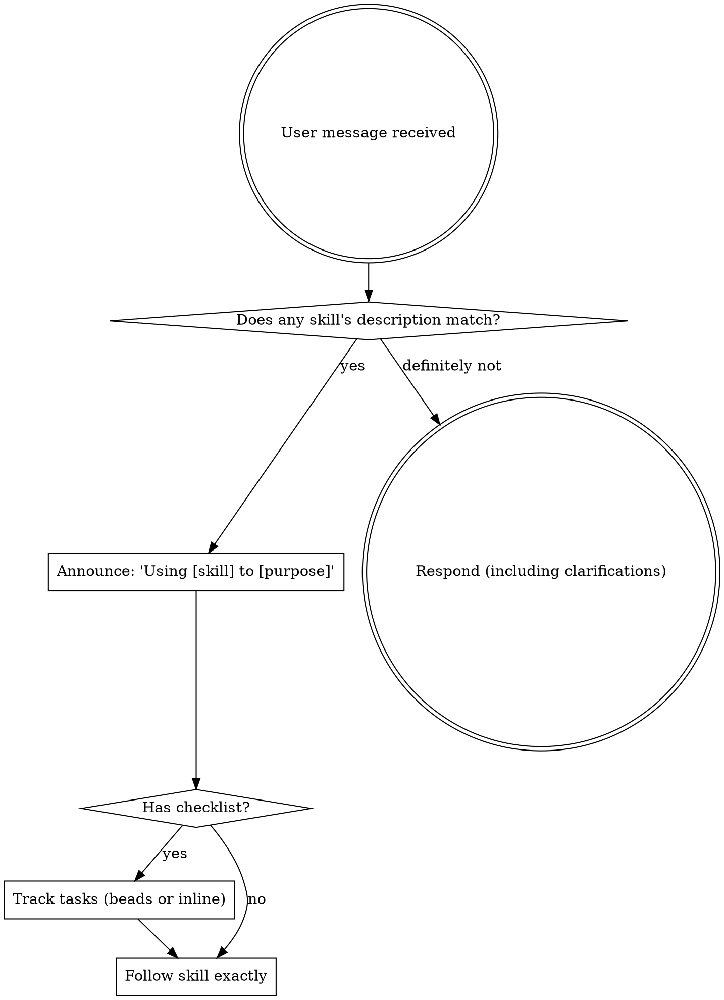

<EXTREMELY-IMPORTANT>
If a skill's description matches what you are doing, you MUST follow it.

IF A SKILL APPLIES TO YOUR TASK, YOU DO NOT HAVE A CHOICE. YOU MUST USE IT.

This is not negotiable. This is not optional. You cannot rationalize your way out of this.
</EXTREMELY-IMPORTANT>

## How Skills Work in OpenClaw

Skills are loaded automatically by the system when their descriptions match the current task. You don't need to invoke or load them — they appear in your `<available_skills>` context. When a skill applies, follow it directly.

# Using Skills

## The Rule

**Follow relevant skills BEFORE any response or action.** Skills are mandatory workflows, not optional suggestions. If a skill's description matches your task, follow it completely.

### Task Tracking

When a skill has a checklist, detect available tracking:
- If a bead ID was passed from a prior skill (e.g., brainstorming → writing-plans), use it as the parent and look for existing child beads
- If `.beads/` exists in the project or `bd` is on PATH → use beads:
  - `bd create -t "Task N: description" -p medium` to create
  - `bd update <id> --status=in_progress` when beginning work
  - `bd close <id>` when complete
- Otherwise → track inline in the plan markdown:
  - `- [ ] Task N: description` → `- [x] Task N: description`

### Subagent Dispatch

When a skill calls for dispatching subagents, use `sessions_spawn`:
- `runtime: "acp"` for coding tasks that need file access
- `mode: "run"` for one-shot tasks (implement, review)
- Include full task context in the `task` parameter (don't make subagent read files)
- Set `workdir` to the project directory

## Red Flags

These thoughts mean STOP — you're rationalizing:

| Thought | Reality |
|---------|---------|
| "This is just a simple question" | Questions are tasks. Check for matching skills. |
| "Let me explore the codebase first" | Skills tell you HOW to explore. Check first. |
| "This doesn't need a formal skill" | If a skill matches, use it. |
| "This doesn't count as a task" | Action = task. Check for skills. |
| "The skill is overkill" | Simple things become complex. Use it. |
| "I'll just do this one thing first" | Check BEFORE doing anything. |
| "This feels productive" | Undisciplined action wastes time. Skills prevent this. |

## Skill Priority

When multiple skills could apply, use this order:

1. **Process skills first** (brainstorming, debugging) - these determine HOW to approach the task
2. **Implementation skills second** (frontend-design, mcp-builder) - these guide execution

"Let's build X" → brainstorming first, then implementation skills.
"Fix this bug" → debugging first, then domain-specific skills.

## Skill Types

**Rigid** (TDD, debugging): Follow exactly. Don't adapt away discipline.

**Flexible** (patterns): Adapt principles to context.

The skill itself tells you which.

## User Instructions

Instructions say WHAT, not HOW. "Add X" or "Fix Y" doesn't mean skip workflows.
